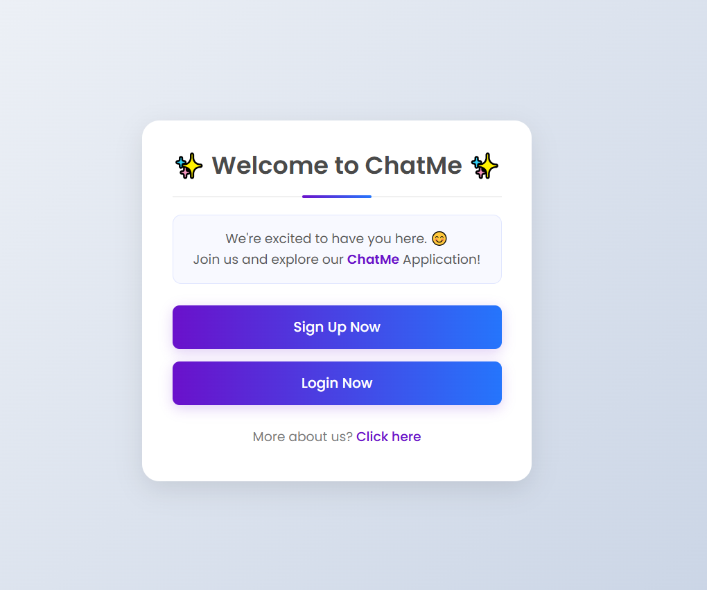

# Simple Web Chat Application

This is a basic web-based chat application built using **PHP, MySQL, HTML, CSS, and JavaScript**.

The application allows users to communicate in real-time within a chat room, displaying messages as they are posted by others. This README provides an overview of the setup and functionality.

Index Page

## Features

- **User Authentication:** Users can create accounts and log in to participate in the chat.
- **Real-Time Messaging:** Messages are displayed in real-time, without needing to refresh the page.
- **Message Storage:** Chat history is stored in a MySQL database for persistence.
- **Simple UI:** The front end is styled using CSS and provides a clean, user-friendly interface.

## Usage

1. **Sign Up:** New users can register to create an account.
3. **Log In:** Existing users can log in to access the chat room.
4. **Chat:** Users can send messages, which appear in real-time for all active users.

## Technologies Used
- **PHP:** Backend logic, user authentication, and database interaction.
- **MySQL:** Database for storing user credentials and chat messages.
- **HTML & CSS:** Frontend structure and styling.
- **JavaScript:** Handles real-time message updates and dynamic UI behavior.

## Setup

1. **Clone the Repository:** Clone this project to your local server (e.g., XAMPP, WAMP).
2. **Database Configuration:**
   - Create a MySQL database for the project.
   - Import the `chatapp.sql` file provided in the project to set up the necessary tables (e.g., `users` and `messages`).
3. **Run the Project:** Start a local PHP server (e.g., using XAMPP or WAMP) and access the application via your web browser.
